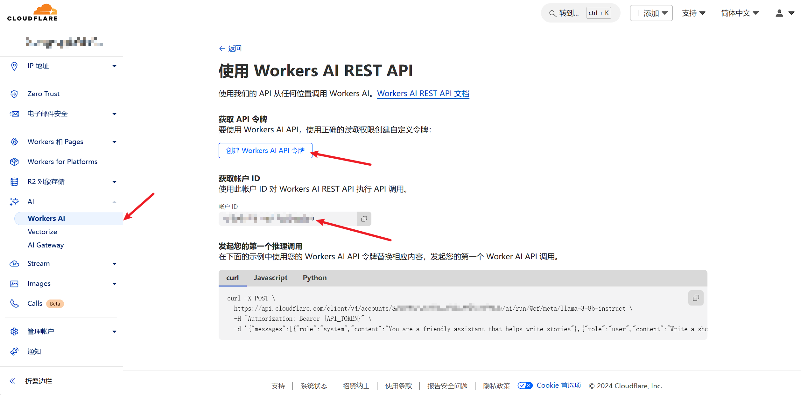

# 重构版 LET MONITOR

一个基于 Workers AI 的 LowEndTalk/LowEndSpirt 新帖/评论监控。获取到信息后，交由 AI 进行翻译、总结、筛选，并推送到 Telegram 等不同渠道。

DEMO：https://t.me/letleblessub

## 功能

- **新帖监控**：监控 offer 区新帖，并由AI进行总结翻译。
- **评论监控**：监控帖子作者的后续评论，由AI筛选有价值评论推送。

## 限制

AI 需要调校，可能会输出预期以外的结果。

## 安装和配置

### Docker 安装

由于需要配置数据库，建议使用 `docker-compose` 安装

```bash
git clone https://github.com/vpslog/let-monitor/
cd let-monitor
# nano docker-compose.yml 修改密码
docker compose up --build -d
```

`docker compose up --build -d` 会基于仓库中的 `Dockerfile` 构建最新镜像，确保后台面板包含你本地的修改功能，而不是继续使用 Docker Hub 上的旧版本镜像。

访问`8081`即可。需要提供 telegram 相关信息、Cloudflare Workers AI 凭据。如下图获取：



可以调整 prompt 和 model 适应不同需求
